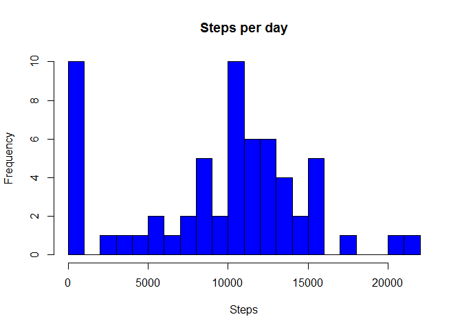
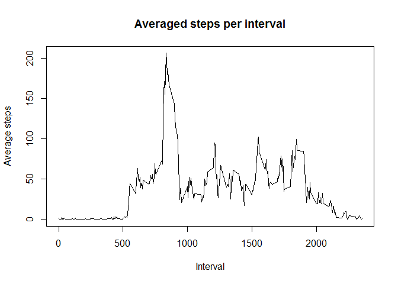
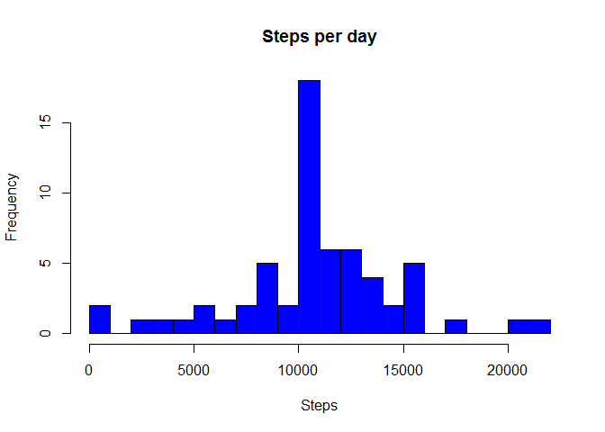
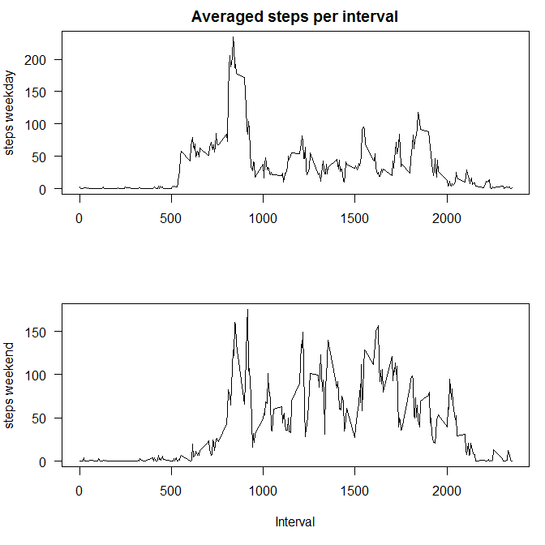

# Reproducible Research: Peer Assessment 1


## Loading and preprocessing the data
First, data wil be loaded and preprocessed for the analysis:

```r
data = read.csv("activity.csv", header = TRUE, sep = ",", na.strings = "NA")
# Load lubridate library
library(lubridate)
# Convert column date to class Date
data$date <- ymd(data$date)
```

## What is mean total number of steps taken per day?
The total number of steps per day is calculted and an histogram generated:

```r
stepsperday <- tapply(data$steps, data$date, sum, na.rm = TRUE)
hist(stepsperday, main = "Steps per day", col = "blue", xlab = "Steps", breaks=20)
```

 

Mean and median values are:

```r
mean(stepsperday)
```

```
## [1] 9354.23
```

```r
median(stepsperday)
```

```
## [1] 10395
```


## What is the average daily activity pattern?
This plot representds the 5-minute interval (x-axis) and the average number of steps taken, averaged across all days (y-axis)

```r
mean_spi <- tapply(data$steps, data$interval, mean, na.rm = TRUE)
plot(names(mean_spi), mean_spi, type = "l", xlab = "Interval", 
     ylab = "Average steps", main = "Averaged steps per interval")
```

 

The 5-minute interval, on average across all the days in the dataset, that contains the maximum number of steps is

```r
# Max value
max(mean_spi)
```

```
## [1] 206.1698
```

```r
# Interval 
inter <- which.max(mean_spi)
names(inter)
```

```
## [1] "835"
```

## Imputing missing values
The total number of missing values in the dataset is:

```r
sum(is.na(data$steps))
```

```
## [1] 2304
```
The missing values are filled with the 5min correspondent interval mean:

```r
data$newsteps <- data$steps
data$newsteps[!is.na(data$steps)] <- data$steps[!is.na(data$steps)]
data$newsteps[is.na(data$steps)] <- mean_spi[as.character(data$interval[is.na(data$steps)])]
```
The correspondent histrogram is plotted

```r
stepsperday2 <- tapply(data$newsteps, data$date, sum)
hist(stepsperday2, main = "Steps per day", col = "blue", xlab = "Steps", breaks=20)
```

 

And the mean and median values calculated

```r
mean(stepsperday2)
```

```
## [1] 10766.19
```

```r
median(stepsperday2)
```

```
## [1] 10766.19
```
These values are different from the first part of this assigment. The impact of impputing missing data is an overestimation of the values, even if we do not know exactly the nature of the missing values. The strategy for filling the values is really important to represent accurately the reality.


## Are there differences in activity patterns between weekdays and weekends?
A new factor variable in the dataset with two levels - "weekday" and "weekend" indicating whether a given date is a weekday or weekend day is created:

```r
data$daytype <- weekdays(data$date)
data$daytype[data$daytype != "Saturday" & data$daytype != "Sunday"] <- "weekday"
data$daytype[data$daytype != "weekday"] <- "weekend"
data$daytype <- as.factor(data$daytype)
```

```r
## What is the average daily activity pattern?
mean_spi_weekday <- tapply(data$steps[data$daytype == "weekday"], data$interval[data$daytype == "weekday"], mean, na.rm = TRUE)
mean_spi_weekend <- tapply(data$steps[data$daytype == "weekend"], data$interval[data$daytype == "weekend"], mean, na.rm = TRUE)
```


```r
par(mfrow = c(2, 1), mar = c(5, 4, 2, 1), las = 1)
plot(names(mean_spi), mean_spi_weekday, type = "l", ylab = "steps weekday", xlab = "", main = "Averaged steps per interval")
plot(names(mean_spi), mean_spi_weekend, type = "l", ylab = "steps weekend", xlab = "Interval")
```

 

The patterns for weekdays and weekend present some clear differences. For example, it is clear that the activity starts later during weekends and there is more activity during all the day.
